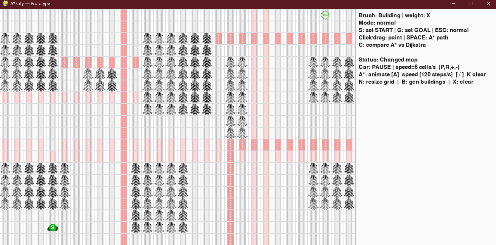
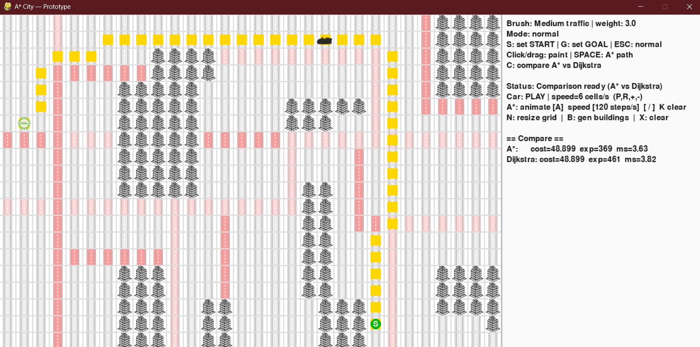

# AStarCity — Visualizador de Búsqueda de Caminos

Visualizador interactivo de algoritmos de búsqueda de caminos construido con Python y Pygame. Coloca edificios, configura zonas de tráfico y observa cómo **A\*** y **Dijkstra** encuentran la ruta óptima a través de una cuadrícula urbana con pesos — paso a paso, con métricas en tiempo real.


---

## Qué hace

- **Editor de cuadrícula interactivo** — pinta edificios, calles libres, zonas de tráfico medio y atascos con el ratón antes de ejecutar la búsqueda.
- **A\* con heurística octile** — correcta para movimiento en 8 direcciones con terreno ponderado. La heurística se escala por el peso mínimo transitable para mantenerse admisible en todos los tipos de terreno.
- **Dijkstra** — garantiza el camino óptimo por expansión exhaustiva; se usa como referencia de comparación.
- **Comparativa lado a lado** — ejecuta ambos algoritmos sobre el mismo mapa con una sola tecla y compara coste del camino, nodos expandidos y tiempo de ejecución.
- **Animación paso a paso** — observa cómo se expande la frontera de búsqueda nodo a nodo antes de dibujar el camino final.
- **Prevención de paso por esquinas** — los movimientos diagonales quedan bloqueados cuando alguna celda adyacente es un edificio, evitando que el agente se cuele entre obstáculos.
- **Ejecutable independiente** — distribuido como binario Windows x64; no requiere instalación de Python.

---

## Capturas

| Editor de mapa y tipos de terreno | Comparativa A\* vs Dijkstra |
|---|---|
|  |  |

---

## Tipos de terreno

| Tipo | Peso | Color |
|---|---|---|
| Calle libre | 1,0 | Blanco |
| Tráfico medio | 3,0 | Azul claro |
| Atasco | 7,0 | Rojo claro |
| Edificio | — | Gris oscuro (intransitable) |

El coste de movimiento escala con el peso del terreno. Un paso diagonal cuesta `√2 × peso`; un paso cardinal cuesta `1,0 × peso`. A\* tiene en cuenta esto tanto en el coste de arco como en la heurística.

---

## Controles

| Tecla / Acción | Descripción |
|---|---|
| **Clic izquierdo** | Pintar terreno seleccionado |
| **Clic derecho** | Borrar celda (volver a calle libre) |
| **S** | Establecer posición de salida (hacer clic en una celda tras pulsar S) |
| **G** | Establecer posición de destino (hacer clic en una celda tras pulsar G) |
| **1 / 2 / 3 / 4** | Seleccionar terreno: libre / tráfico medio / atasco / edificio |
| **A** | Ejecutar A\* con animación paso a paso |
| **D** | Ejecutar Dijkstra con animación paso a paso |
| **C** | Ejecutar ambos y mostrar el panel de comparativa |
| **R** | Reiniciar la cuadrícula |
| **ESC** | Salir |

---

## Estructura del proyecto

```
AStarCity/
├── run_game.py                  # Punto de entrada
├── src/
│   └── astar_city/
│       ├── astar.py             # Implementación de A*
│       ├── astar_stepper.py     # A* como generador Python (controla la animación)
│       ├── constants.py         # Dimensiones del grid, tamaño de celda, FPS y velocidades de animación
│       ├── dijkstra.py          # Implementación de Dijkstra
│       ├── grid.py              # Cuadrícula, expansión de vecinos, consulta de pesos
│       ├── heuristics.py        # Heurística de distancia octile
│       ├── path.py              # Reconstrucción del camino desde el mapa came_from
│       ├── search_result.py     # Dataclass SearchResult (camino, nodos expandidos, coste)
│       └── terrain.py           # Enum TerrainType y configuración TerrainSpec
├── ui/
│   └── pygame_app.py            # Interfaz Pygame, renderizado y bucle de eventos
├── tests/
│   ├── test_astar_basic.py      # Tests básicos de corrección del algoritmo
│   └── test_astar_weighted.py   # Tests con terreno ponderado
├── tools/
│   └── demo_neighbors.py        # Utilidad de desarrollo — depurador de expansión de vecinos
├── assets/                      # Sprites
└── readme_assets/               # Capturas y GIF de demostración
```

---

## Notas técnicas

**¿Por qué distancia octile?** La distancia Manhattan asume movimiento solo en 4 direcciones y sobreestimaría el coste real de los movimientos diagonales, rompiendo la garantía de optimalidad de A\*. La distancia octile es el coste mínimo exacto en una cuadrícula de 8 conexiones sin pesos, y escalarla por el peso mínimo de terreno mantiene la heurística admisible incluso cuando las celdas tienen costes distintos.

**¿Por qué un generador para la animación?** `astar_stepper.py` implementa A\* como generador Python que emite un snapshot de expansión por paso — conjunto abierto, conjunto cerrado, nodo actual. Esto desacopla completamente el algoritmo del bucle de renderizado: la UI puede consumir pasos a cualquier velocidad sin modificar el algoritmo.

**Desempate en el heap:** cuando dos nodos comparten el mismo f-score, se usa un contador `tie` creciente como clave de ordenación secundaria, evitando la comparación directa de tuplas `Coord` y posibles errores de tipo.

---

## Ejecución desde el código fuente

**Requisitos:** Python 3.10+, Pygame 2.x.

```bash
git clone https://github.com/gutierrezmigueljeronimo/AStar-Project.git
cd AStar-Project
pip install pygame
python run_game.py
```

---

## Ejecución del ejecutable (Windows x64)

Descarga la última release y extrae el ZIP. Ejecuta `AStarCity.exe` directamente — no se necesita Python instalado.

```
AStarCity-windows-x64/
└── dist/
    └── AStarCity/
        ├── AStarCity.exe
        └── internal/
```

> El ejecutable fue compilado con PyInstaller. Windows Defender puede mostrar un aviso la primera vez que se ejecuta — es el comportamiento esperado para binarios PyInstaller sin firma.

---

## Contexto académico

Desarrollado como ejercicio individual para el Curso de Especialización en IA y Big Data en EUSA — Cámara de Comercio de Sevilla (2026).
